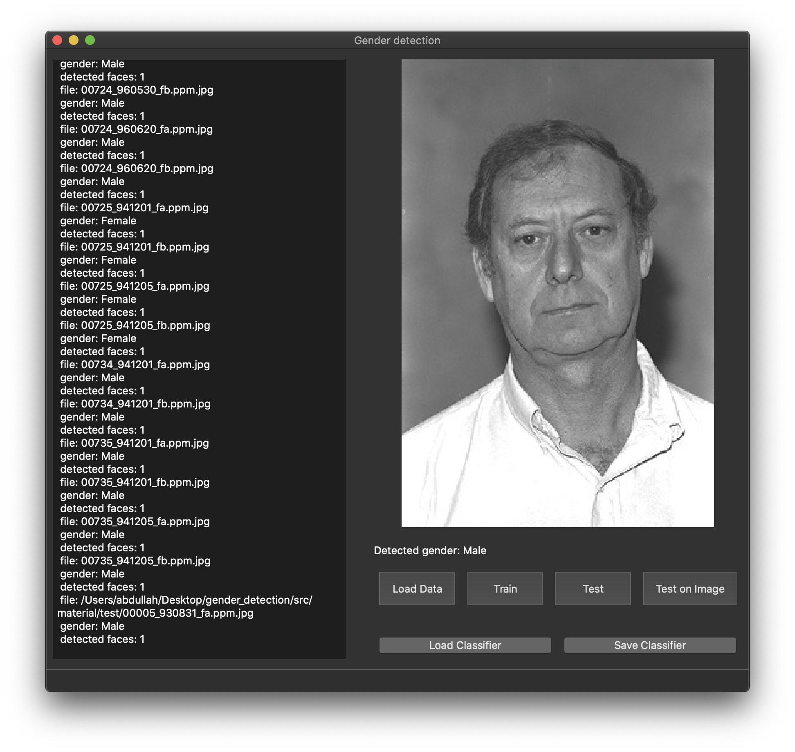

# gender detection
train a neural network for detecting gender on faces. youre able to load an store your trained model.

# informations:
implemented in c++ with following frameworks:
- UI: [Qt](/usr/local/share/opencv4/haarcascades/)
- image processing: [OpenCV](https://opencv.org)
- machine learning: [Shark](http://image.diku.dk/shark/)
- advanced c++ [boost](https://www.boost.org)

# nice screenshots:

